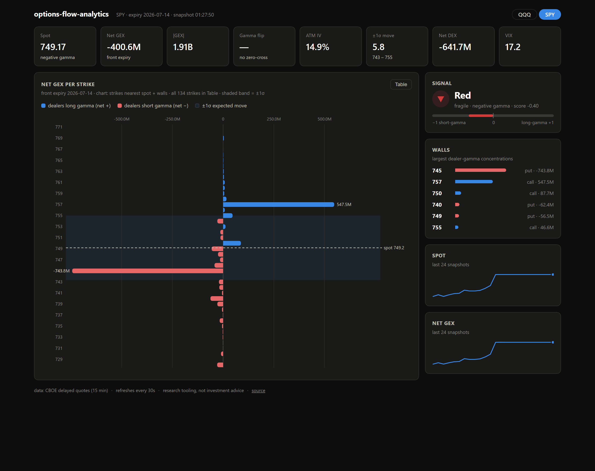
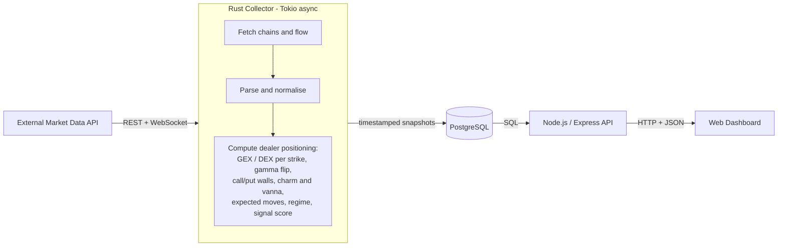

# options-flow-analytics

Real-time options analytics: dealer positioning (GEX / DEX) computed live from option chains and flow, to read market regimes and generate trading signals. Dealer positioning is the most mechanically explainable force in intraday markets, so I built the system I wanted to exist.

> This repository is a working MVP of the architecture: Rust collector, PostgreSQL, Node.js API + dashboard, one command to run. **By default it runs on real market data**: CBOE's free delayed-quotes feed (15-min delayed chains with IV and open interest, no API key). A synthetic provider ships alongside for offline demos, and the `MarketDataProvider` trait is where any other feed plugs in.



*Live SPY snapshot: a −743M put wall at 745 and a +547M call wall at 757 boxing in spot, the ±1σ expected-move band shaded, dealer regime and signal at a glance. Hover any strike for its full breakdown; the Table toggle exposes the entire chain.*

## Run it

```bash
docker compose up --build
# dashboard: http://localhost:3000
```

Local dev: `cd collector && cargo test && cargo run` (needs a local Postgres, see `DATABASE_URL` default) and `cd api && npm install && npm start`.

| Env | Default | Meaning |
|---|---|---|
| `TICKERS` | `SPY,QQQ` | comma-separated tickers to snapshot |
| `INTERVAL_SECS` | `30` | seconds between snapshot cycles |
| `PROVIDER` | `cboe` | `cboe` = real delayed data, no key · `synthetic` = offline generator |
| `SYNTHETIC_SPOT` | `500` | base spot for the synthetic walk |
| `RETENTION_DAYS` | `30` | pruning horizon for old snapshots |

The CBOE provider takes the nearest listed expiry (DTE ≥ 1), where dealer positioning concentrates; CBOE also returns its own greeks per contract, which make a handy cross-check against the ones computed here.

## Deploy

- **AWS**: single-EC2 tier (what I run) and the managed-services growth path: [docs/DEPLOY_AWS.md](docs/DEPLOY_AWS.md)
- **Kubernetes**: manifests in [`k8s/`](k8s/) (namespace, Postgres StatefulSet, single-writer collector Deployment with `Recreate` strategy, scalable API Deployment + Service + Ingress, probes on `/healthz`). Validated with kubeconform. Local: `kubectl apply -f k8s/ && kubectl -n options-flow port-forward svc/api 3000:80`

## Architecture



Two microservices around a database, Dockerised, deployed on EC2 with PostgreSQL in a container.

## What it computes

- **Net / absolute GEX** per expiry and per strike, aggregated from open interest and greeks
- **Gamma flip level**: the spot price where dealer gamma changes sign, i.e. where hedging flows switch from dampening to amplifying moves
- **Call and put walls**: strike concentrations that act as magnets or barriers
- **Charm and vanna**: second-order greek exposures that drive pre-expiry drift
- **DEX profile**: net dealer delta exposure across the chain
- **Expected moves**, ATM IV, VIX context, VWAP, premarket context
- **Market-regime classification** and a composite signal score ("traffic light") with trade advice

## Data model

Snapshot-oriented: one row per (ticker, timestamp) with hot scalar columns for filtering and JSONB payloads for full per-strike profiles. Designed around the two query patterns that matter: "latest snapshot for ticker" and "everything for a day". See [`schema.sql`](schema.sql).

```sql
CREATE INDEX IF NOT EXISTS idx_snapshots_ticker_timestamp
    ON gex_dex_snapshots (ticker, timestamp DESC);
```

Retention is a pruning job, additive schema evolution only (new columns with defaults, JSONB extension points), so readers never break.

## Design decisions

- **Rust + Tokio** for the collector: sustained WebSocket ingestion and greek math on every snapshot, with predictable latency and no GC pauses
- **PostgreSQL over a time-series DB**: JSONB flexibility for evolving analytics beats specialised compression at this scale; the indexes carry the query patterns
- **Postgres in Docker on EC2 rather than RDS**: at personal scale, one instance with volume snapshots costs a fraction of managed Postgres, and I wanted to own the failure modes
- **Deterministic pipeline, no ML in the hot path**: positioning math is exact; interpretation is layered on top and can be rebuilt from raw snapshots (`raw_options` is kept per row)

## Layout

```
collector/   Rust: provider -> greeks -> analytics -> db   (unit-tested: cargo test)
api/         Node.js/Express API + self-contained dashboard (public/index.html)
schema.sql   the data model, embedded by the collector at compile time
```

## Stack

Rust (Tokio, tokio-postgres) · PostgreSQL · Node.js/Express · Docker Compose · AWS EC2
